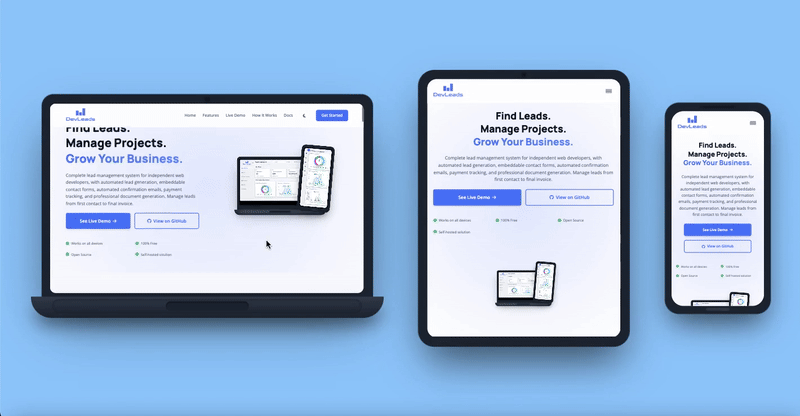

# Device Mockup Web Component
#### Device Mockups w/ images and videos


#### Device Mockups w/ iframes


A customizable web component that renders realistic device mockups (laptop or phone) with support for images, videos, and multiple fallback formats.

## Features

- Single component supports laptop, phone, and tablet devices
- Auto-detects media type (image vs video) from file extension
- Multiple fallback format support (AVIF, WebP, PNG, MP4, WebM, etc.)
- Automatic theme detection (light/dark) or manual override
- Hover state support with fallbacks
- Clickable links - make entire device a clickable link
- **Interactive iframe previews** - display websites in device-sized viewports
- Customizable colors via attributes or CSS custom properties
- Easy sizing with width/height attributes - automatic proportional scaling
- Fully responsive - scales proportionally at any size
- No default animations - add your own with CSS
- Fully accessible with ARIA support

## Installation

```html
<script
  src="https://cdn.jsdelivr.net/gh/DevManSam777/device-mockup@main/device-mockup.js"
  defer
></script>
```

## Usage

```html
<!-- Laptop with image -->
<device-mockup
  type="laptop"
  src="screenshot.avif"
  fallback="screenshot.webp"
  fallback-2="screenshot.png"
  alt="Dashboard analytics view"
>
</device-mockup>

<!-- Phone with video -->
<device-mockup
  type="phone"
  src="demo.webm"
  fallback="demo.mp4"
  fallback-2="poster.png"
  hover-src="demo-hover.webm"
  alt="Mobile app demo"
  theme="dark"
>
</device-mockup>
```

## Attributes

### Media & Display
- `type` - Device type: `"laptop"`, `"phone"`, or `"tablet"` (required)
- `src` - Primary media source (required)
- `fallback` - First fallback source (optional)
- `fallback-2` - Second fallback source (optional)
- `hover-src` - Media to show on hover (optional)
- `hover-fallback` - First hover fallback (optional)
- `hover-fallback-2` - Second hover fallback (optional)
- `alt` - Alt text for accessibility (required)
- `theme` - Theme override: `"light"`, `"dark"`, or `"auto"` (default: `"auto"`)

### Layout & Sizing
- `width` - Custom width in pixels (e.g., `"500"` or `"500px"`) - automatically scales device proportionally (optional)
- `height` - Custom height in pixels (e.g., `"400"` or `"400px"`) - automatically scales device proportionally (optional)
- `padding` - CSS padding value for the main media (e.g., `"3px"`, `"0.5rem"`) (optional, default: `"0"`)
- `hover-padding` - CSS padding value for hover media (optional, defaults to `padding` value)
- `fit` - Object-fit value for main media: `"cover"`, `"contain"`, `"fill"`, `"none"`, or `"scale-down"` (optional, default: no object-fit)
- `hover-fit` - Object-fit value for hover media (optional, default: no object-fit)

**⚠️ Important:** Use **EITHER** `width` **OR** `height` attribute, not both. The component automatically maintains aspect ratios - if you set width, height adjusts automatically, and vice versa. If both are provided, only `width` will be used.

### Interactivity
- `href` - URL to navigate to when clicked (optional, makes the entire device clickable)
- `target` - Link target: `"_self"`, `"_blank"`, `"_parent"`, or `"_top"` (optional, default: `"_blank"`, only used with `href`)
- `mode` - Rendering mode: `"iframe"` to display the URL as a live website directly in the device screen, or omit for regular link behavior (optional)

### Color Customization (Attributes)
- `frame-color` - Main device frame/bezel color (optional)
- `frame-dark` - Darker frame accents for notches and camera (optional)
- `base-color` - Laptop base and phone home indicator color (optional)
- `base-dark` - Darker accents for laptop base details (optional)
- `shadow-color` - Drop shadow color and opacity (optional)

**Note:** Not all devices use all color properties. See [Color Customization](#custom-colors) for details.

## Recommended Media Dimensions

For best results, use media with these aspect ratios:

**Laptop:**

- Aspect ratio: **16:9** (landscape)
- Recommended dimensions: 1920x1080, 1600x900, 1280x720, or 800x450

**Phone:**

- Aspect ratio: **9:16** (portrait)
- Recommended dimensions: 1080x1920, 720x1280, 1170x2532, or 450x800

**Tablet:**

- Aspect ratio: **4:3** (portrait)
- Recommended dimensions: 2048x2732, 1536x2048, 1024x1366, or 768x1024

Using the correct aspect ratio ensures media displays properly without distortion. If your media has a different aspect ratio, use the `fit` and `padding` attributes to control how it's displayed.

## Fine-tuning Image Fit

### Using Padding

If your images don't match the exact aspect ratios or you want an inset border effect, use the `padding` attribute:

```html
<!-- Add padding to create an inset border effect -->
<device-mockup
  type="laptop"
  src="screenshot.png"
  padding="3px"
  alt="Dashboard with border"
>
</device-mockup>

<!-- Different padding for main and hover images -->
<device-mockup
  type="phone"
  src="screen1.png"
  padding="4px"
  hover-src="screen2.png"
  hover-padding="2px"
  alt="App screens"
>
</device-mockup>
```

### Using Object-fit

For media with different aspect ratios, use the `fit` attribute to control how the content fills the device screen:

```html
<!-- Use cover to fill the screen (may crop edges) -->
<device-mockup type="laptop" src="video.mp4" fit="cover" alt="Video demo">
</device-mockup>

<!-- Use contain to show full content (may have letterboxing) -->
<device-mockup
  type="phone"
  src="screenshot.png"
  fit="contain"
  alt="Full screenshot"
>
</device-mockup>

<!-- Different fit for main and hover images -->
<device-mockup
  type="laptop"
  src="screenshot.png"
  fit="contain"
  hover-src="video.mp4"
  hover-fit="cover"
  alt="Mixed media demo"
>
</device-mockup>
```

**fit values:**

- `cover` - Fills the screen, may crop content to maintain aspect ratio
- `contain` - Shows full content, may add letterboxing
- `fill` - Stretches to fill (may distort)
- `none` - Uses natural size (default)
- `scale-down` - Uses smaller of `none` or `contain`

## Sizing

There are three ways to control the size of device mockups:

### Method 1: Using Width or Height Attributes (Recommended)

The easiest way - just specify the desired width **OR** height and the device scales proportionally:

```html
<!-- Set exact width - height adjusts automatically -->
<device-mockup
  type="laptop"
  src="screenshot.png"
  alt="Dashboard"
  width="500"
>
</device-mockup>

<!-- Or set exact height - width adjusts automatically -->
<device-mockup
  type="phone"
  src="app.png"
  alt="Mobile app"
  height="600"
>
</device-mockup>
```

**⚠️ Important:** Don't use both `width` and `height` together - pick one! The component automatically maintains the correct aspect ratio based on whichever you choose.

**Base dimensions for reference:**
- **Laptop**: 238px wide × 154px tall
- **Phone**: 126px wide × 252px tall
- **Tablet**: 182px wide × 238px tall

### Method 2: Using CSS Custom Properties

Use the `--device-scale` variable for precise control:

```css
device-mockup {
  --device-scale: 1.5; /* 150% of original size */
}
```

### Method 3: Using CSS Width

Set a width via CSS and the component scales to fit:

```css
device-mockup {
  width: 600px; /* Component scales proportionally */
}
```

**Note:** All three methods maintain the device's aspect ratio and scale all elements proportionally.

## Custom Animations

The component has no default animations. Add your own with CSS:

```css
device-mockup {
  animation: float 3s ease-in-out infinite;
}

@keyframes float {
  0%,
  100% {
    transform: translateY(0);
  }
  50% {
    transform: translateY(-10px);
  }
}
```

## Clickable Links

Make your device mockups clickable by adding an `href` attribute. The entire device becomes a clickable link:

```html
<!-- Open link in same tab -->
<device-mockup
  type="laptop"
  src="dashboard.png"
  alt="View live demo"
  href="https://example.com/demo"
>
</device-mockup>

<!-- Open link in new tab -->
<device-mockup
  type="phone"
  src="app.png"
  alt="Download app"
  href="https://example.com/download"
  target="_blank"
>
</device-mockup>

<!-- Link with hover effect -->
<device-mockup
  type="tablet"
  src="feature-1.png"
  hover-src="feature-2.png"
  alt="View features"
  href="/features"
>
</device-mockup>
```

**Link behavior:**
- The entire device mockup becomes clickable when `href` is provided
- On hover, the device slightly scales up (1.02x) with a smooth transition
- Links open in a new tab by default (`target="_blank"`), or use `target` attribute to customize
- Works perfectly with hover states - users can still see the hover media before clicking

## Live Iframe Mode

Add `mode="iframe"` to display a **live, interactive website** directly in the device screen instead of static media. No `src` attribute needed.

```html
<!-- Live website in laptop screen -->
<device-mockup
  type="laptop"
  alt="My website"
  href="https://your-website.com"
  mode="iframe"
  width="400"
>
</device-mockup>

<!-- Live website in phone screen -->
<device-mockup
  type="phone"
  alt="Mobile view"
  href="https://your-website.com"
  mode="iframe"
  height="300"
>
</device-mockup>
```

### How It Works

The website loads in a real iframe inside the device screen. The iframe is automatically scaled to fit:
- **Laptop:** Loads at 1280×800px, scaled to fit the screen
- **Phone:** Loads at 375×812px, scaled to fit the screen
- **Tablet:** Loads at 768×1024px, scaled to fit the screen

You can scroll and interact with the website directly inside the device mockup.

### ⚠️ Important Limitations

**Most websites will NOT work in iframe mode** due to security restrictions:

1. **X-Frame-Options Blocking**
   - Many sites send `X-Frame-Options: DENY` or `X-Frame-Options: SAMEORIGIN` headers
   - This prevents the browser from loading them in iframes
   - **There is no client-side workaround for this**
   - The iframe will appear blank if the site blocks embedding

2. **Sites That Typically Block Iframes:**
   - Social media (Facebook, Twitter, Instagram, LinkedIn)
   - Search engines (Google, Bing)
   - Streaming services (YouTube, Netflix, Spotify)
   - Banking and financial sites
   - Most commercial websites (Amazon, eBay, etc.)
   - Many SaaS platforms (GitHub, Slack, etc.)

3. **Sites That Usually Allow Iframes:**
   - Wikipedia
   - W3Schools
   - Your own websites (if you control the headers)
   - Some documentation sites
   - Local HTML files

4. **Link Behavior Issues:**
   - Links with `target="_blank"` will open in new tabs (cannot be prevented)
   - Most modern websites use `target="_blank"` for external links
   - This is a browser security feature with no workaround

### When to Use Iframe Mode

**Good use cases:**
- Showcasing your own websites where you control the server headers
- Displaying local HTML files or documentation
- Sites you've verified allow iframe embedding
- Simple static sites without external navigation

**Better alternatives:**
- Use **images or videos** for sites that block iframes
- Use the `href` attribute without `mode="iframe"` to create clickable mockups that open sites in new tabs
- Mix approaches: iframes for your sites, images/videos for others

### Testing If a Site Allows Iframes

Before using iframe mode, test the site manually:

```html
<!-- Quick test in your browser console -->
<iframe src="https://example.com"></iframe>
```

If you see the site load, it allows iframes. If you see a blank frame, it blocks them.

### Server-Side Solution (If You Control the Site)

To make your site work in iframes, configure your server to allow it:

**Remove or modify these headers:**
```
X-Frame-Options: SAMEORIGIN
Content-Security-Policy: frame-ancestors 'self' https://yourdomain.com
```

⚠️ **Security Warning:** Allowing iframe embedding can expose users to clickjacking attacks. Only allow trusted domains.

### Iframe Security Considerations

**Best practices:**
- ✅ Only embed websites you own and trust
- ✅ Use for portfolios, demos, and showcasing your own work
- ❌ Do NOT embed untrusted third-party sites
- ❌ Not recommended for production apps requiring high security

The iframe uses permissive sandbox permissions for site functionality. For untrusted content, use static images or videos instead.

### Iframe Background Color

If the embedded website doesn't explicitly set its own background color, the device's screen background color may show through. You can customize this using either an attribute or CSS:

```html
<!-- Using attribute -->
<device-mockup
  type="laptop"
  href="https://your-site.com"
  mode="iframe"
  screen-bg="white"
></device-mockup>

<!-- Or using CSS custom property -->
<device-mockup
  type="laptop"
  href="https://your-site.com"
  mode="iframe"
  style="--screen-bg: white;"
></device-mockup>
```

Default is `transparent` (matches the device frame color). 

## Custom Colors

You can customize device colors using **either attributes or CSS custom properties**. Both methods work identically - choose whichever fits your workflow better.

### Method 1: Using Attributes

Set colors directly on the element using attributes:

```html
<device-mockup
  type="phone"
  src="screenshot.png"
  alt="Custom colored device"
  frame-color="#3b82f6"
  frame-dark="#1e40af"
  base-color="#60a5fa"
  shadow-color="rgba(59, 130, 246, 0.4)"
>
</device-mockup>
```

### Method 2: Using CSS Custom Properties

Override colors using CSS variables:

```css
device-mockup {
  --frame-color: #3b82f6;
  --frame-dark: #1e40af;
  --base-color: #60a5fa;
  --base-dark: #2563eb;
  --shadow-color: rgba(59, 130, 246, 0.4);
}
```

Or inline styles:

```html
<device-mockup
  type="laptop"
  src="screenshot.png"
  alt="Custom colored device"
  style="--frame-color: #3b82f6; --base-color: #60a5fa;"
>
</device-mockup>
```

### Color Properties by Device Type

**Important:** Not all devices use all color properties. Here's what each device type uses:

#### Laptop
- ✅ `frame-color` - Main frame/bezel
- ✅ `frame-dark` - Top camera dot
- ✅ `base-color` - Laptop base top
- ✅ `base-dark` - Laptop base darker gradient
- ✅ `shadow-color` - Drop shadow

#### Phone
- ✅ `frame-color` - Main frame/bezel
- ✅ `frame-dark` - Top notch/speaker
- ✅ `base-color` - Home indicator bar
- ❌ `base-dark` - (not used)
- ✅ `shadow-color` - Drop shadow

#### Tablet
- ✅ `frame-color` - Main frame/bezel
- ✅ `frame-dark` - Top camera dot
- ❌ `base-color` - (not used)
- ❌ `base-dark` - (not used)
- ✅ `shadow-color` - Drop shadow

### Available Color Properties

- `frame-color` / `--frame-color` - Main device frame/bezel color
- `frame-dark` / `--frame-dark` - Darker frame accents (laptop camera, phone notch, tablet camera)
- `base-color` / `--base-color` - Laptop base and phone home indicator
- `base-dark` / `--base-dark` - Laptop base darker accents
- `shadow-color` / `--shadow-color` - Drop shadow color and opacity
- `screen-bg` / `--screen-bg` - Screen background color (default: `transparent`, matches frame color. See [Iframe Background Color](#iframe-background-color) for iframe usage)

### Color Examples

```html
<!-- Blue phone using attributes -->
<device-mockup
  type="phone"
  src="app.png"
  alt="Blue phone"
  frame-color="#3b82f6"
  frame-dark="#1e40af"
  base-color="#60a5fa"
  shadow-color="rgba(59, 130, 246, 0.4)"
>
</device-mockup>

<!-- Green laptop using CSS -->
<device-mockup
  type="laptop"
  src="dashboard.png"
  alt="Green laptop"
  style="
    --frame-color: #10b981;
    --base-color: #34d399;
    --base-dark: #047857;
    --shadow-color: rgba(16, 185, 129, 0.4);
  "
>
</device-mockup>

<!-- Purple tablet mixing both methods -->
<device-mockup
  type="tablet"
  src="tablet-ui.png"
  alt="Purple tablet"
  frame-color="#a855f7"
  frame-dark="#7e22ce"
  style="--shadow-color: rgba(168, 85, 247, 0.4);"
>
</device-mockup>
```
---
## [MIT License](License)

 &copy;2025 DevManSam
